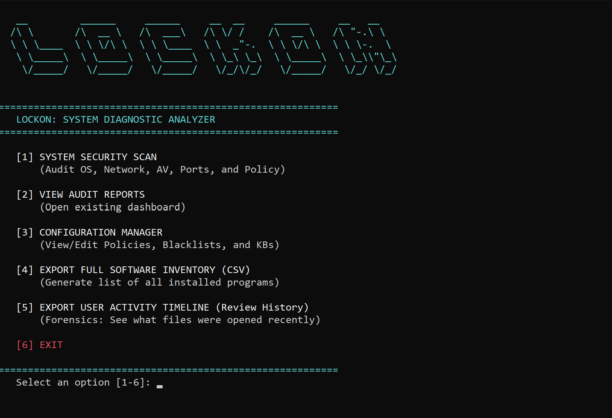
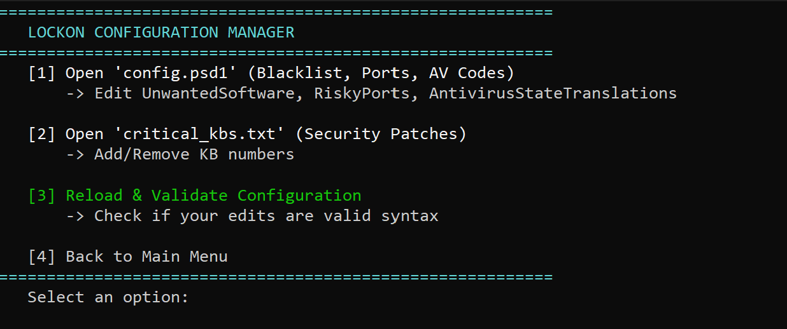

#  LOCKON: SYSTEM DIAGNOSTIC ANALYZER


**LOCKON: SYSTEM DIAGNOSTIC ANALYZER** is an automated PowerShell security auditing and forensics tool designed for Windows environments. It performs deep system inspections to detect misconfigurations, potential threats, and suspicious activities using a baseline-comparison approach.



---

## Concept of Operations (ConOps)

**"Tactical Security. Zero Footprint."**

LOCKON: SYSTEM DIAGNOSTIC ANALYZER is engineered for **Portable "Plug-and-Play" Audits**. It eliminates the need for complex agent installations, making it the perfect tool for rapid assessments across disconnected or high-security environments.

*   **Step 1: Deploy (Flash & Go)**
    *   Load LOCKON onto a secure **USB Flash Drive**.
*   **Step 2: Engage (Scan)**
    *   Plug into any target machine in the organization.
    *   Run `LOCKON_PCheck.bat` immediately (No install required).
*   **Step 3: Analyze (Dashboard)**
    *   Instant HTML Dashboard generation for on-site analysis.
    *   Consolidate results from multiple units into a single view.

---

##  Key Features

*   **Holistic Security Audit:** Scans 20+ system components including Firewall, UAC, Ports, and Patches.
*   **Threat Hunting:** Integrated File Hash analysis (SHA256) against a local Threat DB and Digital Signature verification for Auto-Start items.
*   **Drift Detection:** Automatically compares the current scan against a previous baseline to flag new open ports, new admins, or changed system files.
*   **Forensics:**
    *   **Network:** Hosts file analysis & DNS Cache dump.
    *   **Logs:** Scans Security Event Logs (Last 24h) for Brute Force (4625), Log Clearing (1102), and New Users (4720).
*   **Interactive Dashboard:**
    *   **Rich HTML Report:** Sortable and searchable data tables.
    *   **Unit Management:** Filter by Unit/Department, collapse sections for better visibility, and export specific Unit data to CSV.
    *   **Visual Forensics:** Highlighting for Risky Ports, Dangerous Extensions, and Suspicious Events.

---

## Tech Stack

*   **Core Human interface:** PowerShell 5.1+ (Native Windows Automation)
*   **Web Interface:** HTML5 / CSS3 / JavaScript (Generated Dashboard)
*   **Bootstrapper:** Batch Script (`.bat`) for Auto-Elevation
*   **Data Interchange:** JSON (Intermediary), HTML (Final Report), CSV (Export)

---

## Installation & Usage

1.  **Clone the Repository:**
    ```bash
    git clone https://github.com/Meow-011/LOCKON-SYSTEM-DIAGNOSTIC-ANALYZER.git
    cd LOCKON-SYSTEM-DIAGNOSTIC-ANALYZER
    ```
    > **💡 Tip:** You can copy this entire folder to a **USB Flash Drive** to perform portable scans on offline machines.

2.  **Run the Tool:**
    *   **Double-click** `LOCKON_PCheck.bat` (Recommended - Auto-Admin check)
    *   **OR run via PowerShell:**
        ```powershell
        Set-ExecutionPolicy Bypass -Scope Process -Force
        .\LOCKON_Menu.ps1
        ```

3.  **Main Menu:**
    *   `[1] SYSTEM SECURITY SCAN`: Start the full system scan (Unit-aware) & view HTML Report/Thai Checklist.
    *   `[2] CUSTOM SECURITY SCAN`: Interactive "Hacker-style" menu to select specific checks (1-33).
    *   `[3] VIEW AUDIT REPORTS`: Launch the Unit-Managed Dashboard (Filter, Collapse, Export).
    *   `[4] CONFIGURATION MANAGER`: View/Edit policies, blacklists, and Knowledge Base.
    *   `[5] EXPORT TECHNICAL CHECKLIST (THAI)`: Generate formal audit documentation.
    *   `[6] GENERATE SYSTEM BASELINE`: Capture current state for future Drift Detection.
    *   `[7] EXIT`

---

## Project Structure

```text
LOCKON-SYSTEM-DIAGNOSTIC-ANALYZER/
├── LOCKON_PCheck.bat       # [Launcher] Auto-elevates to Admin and starts the Menu
├── LOCKON_Menu.ps1         # [Main Menu] Interactive console for selecting tools
├── check_security.ps1      # [Core Engine] Main script coordinating the audit logic
├── Generate-Dashboard.ps1  # [Reporting] Aggregates JSON reports into the HTML Dashboard
├── config.psd1             # [Config]/ Settings, Policies, and Global constraints
├── LOCKON_Lib.ps1          # [Library] Shared functions and utilities
│
├── Modules/                # [Logic] Individual Security Check scripts
│   ├── SystemChecks.ps1    # OS, Updates, UAC, AV, ShadowCopy
│   ├── NetworkChecks.ps1   # Firewall, Ports, DNS, Hosts
│   ├── UserLogChecks.ps1   # Event Logs, Admins, RDP, UserAssist
│   ├── AppServiceChecks.ps1# Services, Startup, Tasks, Extensions
│   ├── FileForensicsChecks.ps1 # Hashes, Browser History, Recycle Bin
│   └── DriftCheck.ps1      # System Baseline & Drift Detection
│
├── AuditReports/           # [Output] Generated HTML/JSON Reports (GitIgnored)
└── Database/               # [Data] Definition files
    ├── threat_db.txt       # Known malicious file hashes
    └── critical_kbs.txt    # List of required security hotfixes
```

---

## Configuration Guide (`config.psd1`)



This LOCKON is highly customizable. You can adjust the security policy in `config.psd1`:

*   **RiskyPorts:** Definite risky ports (e.g., 445, 3389, 5900) and their risk descriptions.
*   **UnwantedSoftware:** Blacklist for software (e.g., `BitTorrent`, `Mmimikatz`).
*   **AntivirusStateTranslations:** Map AV status codes to human-readable text (supports Thai/English).
*   **SystemPaths:** Centralized paths for `critical_kbs.txt`, `threat_db.txt`, etc.

---

## Detailed Audit Checklist

<details>
<summary><strong>Click to view all 33 Security Checks</strong></summary>

| ID | Check Name | Description |
| :--- | :--- | :--- |
| **01** | OS Version Check | Verifies Windows Edition, Version, and Build number. |
| **02** | Network Configuration | Lists active adapters, IP addresses, and DNS servers. |
| **03** | OS Update Status | Checks last update time and installation success date. |
| **04** | Antivirus & EDR Status | Verifies Defender/EDR status, definition age, and running state. |
| **05** | Critical Patches (KB) | Checks for missing Securities Hotfixes defined in `critical_kbs.txt`. |
| **06** | Listening Ports (TCP) | Scans for risky open TCP ports (SMB, RDP, Telnet, DBs). |
| **07** | Listening Ports (UDP) | Scans for risky open UDP ports (NetBIOS, DNS, SNMP). |
| **08** | Windows Firewall | Ensures Domain, Private, and Public profiles are Enabled. |
| **09** | User Account Control (UAC) | Verifies `EnableLUA` and `ConsentPromptBehaviorAdmin` (No silent elevation). |
| **10** | Suspicious Services | Flags services masquerading as system processes or running from Temp/AppData. |
| **11** | Local Administrators | Enumerates members of the Admin group; flags suspicious/unknown users. |
| **12** | Open File Shares | Checks for shares open to "Everyone" or "Anonymous" with Write access. |
| **13** | Startup Items | Scans Registry/Folder startups; checks Digital Signatures to spot malware. |
| **14** | Unwanted Software | Checks installed apps against the `config.psd1` blacklist. |
| **15** | File Hash Analysis | Computes SHA256 of running processes against `threat_db.txt`. |
| **16** | Drift Detection | Compares current scan vs Baseline to flag new Ports, Admins, or Software. |
| **17** | Browser Extensions | Lists Extensions for Chrome/Edge/Firefox and flags High-Risk permissions. |
| **18** | Scheduled Task Hunter | Flags tasks executing from suspicious paths or with anomaly names. |
| **19** | Hosts File Analysis | Scans `hosts` file for hijacks (e.g., redirecting Google to fake site). |
| **20** | DNS Cache Forensics | Dumps recent DNS queries to identify C2 beacons or Mining pools. |
| **21** | Event Log Analysis | Scans Security Log (24h) for Brute Force (4625), Log Clear (1102), User Create (4720). |
| **22** | Web Browser History | Extracts recent history from Chrome/Edge to spot suspicious downloads/sites. |
| **23** | Recent Files Activity | Analyzes `Recent` folder, `ShimCache`, and `BAM` to track user activity. |
| **24** | Downloads Folder Analysis | Scans Downloads folder for risky file types (.exe, .ps1, .vbs). |
| **25** | RDP Hunter | Analyzes Event Logs (4624 Type 10) to track incoming Remote Desktop connections. |
| **26** | Shadow Copy Check | Verifies if VSS Shadow Copies exist (crucial for Ransomware recovery). |
| **27** | Local Admin Hunter (Deep) | Deep dive into "Remote Desktop Users" and "Remote Management Users" groups. |
| **28** | DNS Analyzer (Mining/C2) | Advanced regex scan of DNS Cache for known Crypto Mining or C2 patterns. |
| **29** | UserAssist History | Decodes ROT13 UserAssist keys to see *exactly* what programs were run and when. |
| **30** | Recycle Bin Scavenger | Recovers metadata of deleted files to find "Evidence Elimination" attempts. |
| **31** | Protocol Hunter | Checks for vulnerable legacy protocols like SMBv1 (WannaCry vector). |
| **32** | Office Security | Checks VBA Macro security settings (TrustVBA, DisableAll). |
| **33** | Software Inventory | Dumps full list of installed software (Control Panel + Store Apps). |

</details>

---

## Developer Guide (Extensibility)

LOCKON is designed with a **Modular Architecture**. You can easily add new Security Checks or Forensics modules.

### How to add a new check:
1.  **Create Module:** Create a new `.ps1` script in `Modules/` (e.g., `Modules/MyNewCheck.ps1`).
2.  **Define Logic:** Use the standard function pattern `Invoke-LockonMyNewCheck`.
    *   *Input:* Accepts `$Config` object.
    *   *Output:* Returns a Hashtable with `Status`, `Message`, and `Data`.
3.  **Register Module:** Add your new script filename to the `$ModuleFiles` list in `check_security.ps1`.
4.  **(Optional) Add to Menu:** Update `$Checks` array in `LOCKON_Menu.ps1` to include it in the Custom Scan list.


---


##  Troubleshooting

**Q: "Script is not signed" or "Execution of scripts is disabled on this system."**
**A:** This is a Windows security feature. Run this command in PowerShell (Admin) to allow the script to run:
```powershell
Set-ExecutionPolicy RemoteSigned -Scope CurrentUser -Force
```
*Tip: You can revert this later by setting it back to `Restricted`.*

**Q: "Access Denied" errors?**
**A:** This LOCKON requires **Administrator Privileges** to access the Registry, Security Event Logs, and System Folders. Please run `LOCKON_PCheck.bat` as Admin.

